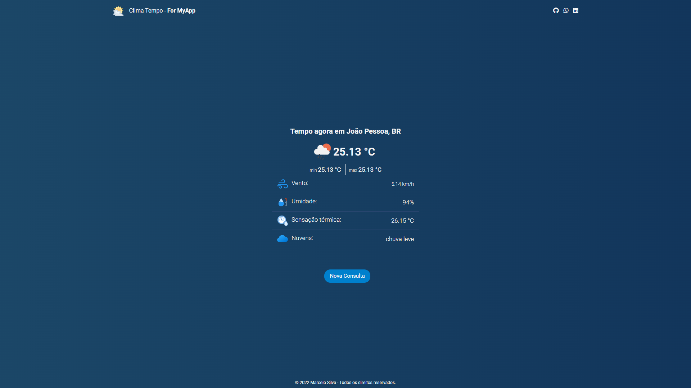

# Clima Tempo - For MyApp

Esta aplicação foi desenvolvida para informar ao usuário a temperatura de determinada localidade consultando pelo nome da cidade. 
Para trazer os dados, estou fazendo uma requisição via fetch a API da [OpenWeather](https://openweathermap.org/api).

## 🚀 Começando

Para ter acesso a aplicação, basta acessar o link: https://climatempoapp.netlify.app/

### 📋 Pré-requisitos

Digitar um nome válido de alguma cidade.

### 🎥 Usabilidade e funcionalidades

Digite o nome da cidade desejada e clique em buscar ou tecle ENTER. Caso a cidade não seja localizada, ele retornará uma mensagem na tela.

## 🛠️ Construído com

Todo o projeto foi construído utilizando:

* [HTML5](https://developer.mozilla.org/pt-BR/docs/Web/HTML) - Toda marcação da aplicação.
* [CSS3](https://developer.mozilla.org/pt-BR/docs/Web/CSS) - Toda a estilização da aplicação.
* [JavaScript](https://developer.mozilla.org/pt-BR/docs/Web/JavaScript) - Toda parte de programação/lógica do front-end.
* [Netlify](https://www.netlify.com/) - Utilizado para fazer deploy do front-end.
* [API](https://openweathermap.org/api) - API que retorna os dados da consulta.
* [Font Awesone](https://kit.fontawesome.com) - Icones da aplicação.

## 📌 Versão

Todo controle de versão foi realizado dentro do repositório do GitHub.

## ✒️ Autores

* **Marcelo Silva** - *Todo front-end da aplicação* - [/EuMarcel0](https://github.com/EuMarcel0)

## 📄 Licença

Open Source

## 🎁 Expressões de gratidão

Fico muito grato por ter concluío este projeto. Graças à Deus deu tudo certo.
💻🚀😊😊
